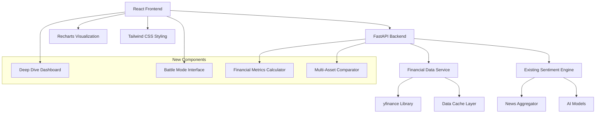

# Investment Research Terminal Design Document

## Overview

The Investment Research Terminal transforms the existing MarketMind analyzer into a professional-grade financial analysis platform. The system integrates real-time financial data from yfinance with AI-powered sentiment analysis to provide comprehensive investment insights through two primary interfaces: Deep Dive Dashboard for single asset analysis and Battle Mode for multi-asset comparison.

The architecture follows a modern client-server pattern with a FastAPI backend handling financial data integration and analysis, and a React frontend providing interactive visualizations using Recharts. The design emphasizes Bloomberg Terminal aesthetics with dark mode, professional color schemes, and responsive layouts.

## Architecture

### High-Level Architecture



### Technology Stack

**Backend Enhancements:**
- FastAPI for new financial data endpoints
- yfinance library for real-time stock data and fundamentals
- Redis/in-memory caching for financial data
- Pydantic models for financial data validation
- Async processing for multi-ticker requests

**Frontend Enhancements:**
- Recharts library for interactive financial charts
- Enhanced Tailwind CSS configuration for Bloomberg-style design
- React state management for multi-view switching
- Responsive design patterns for mobile compatibility

**Integration Layer:**
- Existing sentiment analysis engine integration
- Combined financial and sentiment data models
- Unified API responses for comprehensive analysis

## Components and Interfaces

### Backend Components

#### 1. Financial Data Service
```python
class FinancialDataService:
    async def get_ticker_info(ticker: str) -> TickerInfo
    async def get_price_history(ticker: str, period: str = "1mo") -> PriceHistory
    async def get_fundamental_metrics(ticker: str) -> FundamentalMetrics
    async def get_multi_ticker_data(tickers: List[str]) -> Dict[str, TickerData]
    def calculate_derived_metrics(ticker_data: TickerData) -> DerivedMetrics
```

#### 2. Enhanced Analysis Engine
```python
class EnhancedAnalysisEngine:
    async def analyze_detailed(ticker: str) -> DetailedAnalysisReport
    async def analyze_comparison(tickers: List[str]) -> ComparisonAnalysisReport
    def combine_financial_sentiment(financial: TickerData, sentiment: SentimentData) -> CombinedAnalysis
    def calculate_battle_metrics(analyses: List[CombinedAnalysis]) -> BattleMetrics
```

#### 3. Dashboard Service
```python
class DashboardService:
    async def get_market_mood() -> MarketMood
    async def get_ai_pick(risk_profile: str) -> AIPick
    async def get_portfolio_movers(tickers: List[str]) -> List[PortfolioMover]
    async def generate_dashboard_data(risk_profile: str, portfolio: List[str]) -> DashboardData
    def calculate_fear_greed_index(spy_data: PriceHistory, btc_data: PriceHistory) -> int
```

#### 3. New API Endpoints
```
POST /api/analyze/detailed
- Input: {"ticker": "AAPL"}
- Output: DetailedAnalysisReport with financial + sentiment data

POST /api/analyze/compare  
- Input: {"tickers": ["AAPL", "MSFT", "NVDA"]}
- Output: ComparisonAnalysisReport with side-by-side metrics

POST /api/dashboard
- Input: {"risk_profile": "Aggressive", "portfolio": ["AAPL", "BTC-USD", "TSLA"]}
- Output: DashboardData with market mood, AI pick, and portfolio movers

GET /api/financial/ticker/{ticker}
- Output: Real-time financial data for single ticker

GET /api/financial/batch
- Input: Query params with multiple tickers
- Output: Batch financial data
```

### Frontend Components

#### 1. Deep Dive Dashboard
```jsx
const DeepDiveDashboard = ({ ticker }) => {
  return (
    <div className="deep-dive-container">
      <TickerHeader ticker={ticker} />
      <VitalsGrid metrics={fundamentals} />
      <PriceChart data={priceHistory} newsEvents={newsData} />
      <NewsFeed articles={analyzedNews} />
    </div>
  );
};
```

#### 2. Battle Mode Interface
```jsx
const BattleMode = ({ tickers }) => {
  return (
    <div className="battle-mode-container">
      <TickerSelector onTickersChange={setTickers} />
      <SentimentBattleChart data={sentimentComparison} />
      <FundamentalRadar data={radarMetrics} />
    </div>
  );
};
```

#### 3. Interactive Chart Components
```jsx
const PriceChart = ({ data, newsEvents }) => (
  <ResponsiveContainer width="100%" height={400}>
    <LineChart data={data}>
      <Line type="monotone" dataKey="price" stroke="#10B981" />
      <XAxis dataKey="date" />
      <YAxis />
      <Tooltip />
      {newsEvents.map(event => (
        <ReferenceDot key={event.id} x={event.date} y={event.price} />
      ))}
    </LineChart>
  </ResponsiveContainer>
);
```

## Data Models

### Financial Data Models
```python
@dataclass
class TickerInfo:
    symbol: str
    current_price: float
    market_cap: float
    pe_ratio: Optional[float]
    fifty_two_week_high: float
    fifty_two_week_low: float
    sector: str
    industry: str
    volume: int

@dataclass
class PriceHistory:
    ticker: str
    period: str
    prices: List[PricePoint]
    
@dataclass
class PricePoint:
    date: datetime
    open: float
    high: float
    low: float
    close: float
    volume: int

@dataclass
class FundamentalMetrics:
    pe_ratio: Optional[float]
    market_cap: float
    revenue_growth: Optional[float]
    profit_margin: Optional[float]
    debt_to_equity: Optional[float]
    return_on_equity: Optional[float]
```

### Enhanced Analysis Models
```python
@dataclass
class DetailedAnalysisReport:
    ticker: str
    timestamp: datetime
    financial_data: TickerInfo
    price_history: PriceHistory
    sentiment_analysis: SentimentData
    ai_verdict: str  # "Strong Buy", "Buy", "Hold", "Sell", "Strong Sell"
    confidence_score: float
    news_articles: List[AnalyzedArticle]

@dataclass
class ComparisonAnalysisReport:
    tickers: List[str]
    timestamp: datetime
    individual_analyses: Dict[str, DetailedAnalysisReport]
    battle_metrics: BattleMetrics
    radar_data: RadarChartData

@dataclass
class BattleMetrics:
    sentiment_scores: Dict[str, float]  # ticker -> sentiment score
    growth_scores: Dict[str, float]     # derived from P/E ratios
    safety_scores: Dict[str, float]     # derived from market cap
    hype_scores: Dict[str, float]       # derived from volume/news
```

### Dashboard Data Models
```python
@dataclass
class MarketMood:
    score: int  # 0-100 scale
    label: str  # "Fear", "Neutral", "Greed"
    spy_change: float  # S&P 500 5-day percentage change
    btc_change: float  # Bitcoin 5-day percentage change

@dataclass
class AIPick:
    ticker: str
    name: str
    sentiment_score: int  # 0-100 percentage
    price: float
    news_count: int
    recommendation: str  # "Strong Buy", "Buy", "Hold"
    confidence: float

@dataclass
class PortfolioMover:
    ticker: str
    price: float
    change: float  # percentage change
    trend: str  # "up" or "down"

@dataclass
class DashboardData:
    market_mood: MarketMood
    ai_pick: Optional[AIPick]
    movers: List[PortfolioMover]
    timestamp: datetime
```

### UI State Models
```typescript
interface DeepDiveState {
  ticker: string;
  loading: boolean;
  data: DetailedAnalysisReport | null;
  error: string | null;
}

interface BattleModeState {
  selectedTickers: string[];
  maxTickers: number;
  loading: boolean;
  comparisonData: ComparisonAnalysisReport | null;
  error: string | null;
}

interface ChartConfig {
  colors: {
    bullish: string;    // #10B981
    bearish: string;    // #F43F5E
    neutral: string;    // #94A3B8
  };
  responsive: boolean;
  animations: boolean;
}
```

## Correctness Properties

*A property is a characteristic or behavior that should hold true across all valid executions of a system-essentially, a formal statement about what the system should do. Properties serve as the bridge between human-readable specifications and machine-verifiable correctness guarantees.*

Now I need to analyze the acceptance criteria to determine which ones are testable as properties. Let me use the prework tool:

<function_calls>
<invoke name="prework">
<parameter name="featureName">investment-research-terminal

## Correctness Properties

*A property is a characteristic or behavior that should hold true across all valid executions of a system-essentially, a formal statement about what the system should do. Properties serve as the bridge between human-readable specifications and machine-verifiable correctness guarantees.*

### Property Reflection

After reviewing all identified testable properties, several can be consolidated to eliminate redundancy:

- Properties 7.2, 7.3, and 7.4 (color consistency) can be combined into one comprehensive color scheme property
- Properties 5.3, 5.4, and 5.5 (metric calculations) can be combined into one comprehensive derived metrics property
- Properties 2.4 and 2.5 (chart interactivity and responsiveness) can be combined with other UI responsiveness properties
- Properties 9.2, 9.3, and 9.4 (error handling) can be combined into one comprehensive error handling property

**Property 1: Deep Dive Dashboard routing**
*For any* single ticker input, the system should display the Deep Dive Dashboard view with all required components
**Validates: Requirements 1.1**

**Property 2: Header component completeness**
*For any* ticker analysis, the header should contain ticker symbol, current price, and sentiment badge with appropriate styling
**Validates: Requirements 1.2, 1.3**

**Property 3: Vitals grid data completeness**
*For any* ticker with available data, the vitals grid should display P/E ratio, market cap, 52-week high, AI verdict, and contextual indicators
**Validates: Requirements 1.4, 1.5**

**Property 4: Price chart data requirements**
*For any* ticker, the price chart should contain 1-month of historical data points and support interactive features
**Validates: Requirements 2.1, 2.4**

**Property 5: News event overlay correlation**
*For any* price chart with available news events, colored dots should appear on the price line at corresponding dates
**Validates: Requirements 2.3**

**Property 6: Responsive chart behavior**
*For any* screen size, charts should resize appropriately while maintaining readability and functionality
**Validates: Requirements 2.5, 7.5**

**Property 7: News feed layout and content**
*For any* Deep Dive Dashboard, the news feed should appear in the right sidebar with scrollable headlines containing sentiment indicators
**Validates: Requirements 3.1, 3.2, 3.3**

**Property 8: Empty state handling**
*For any* missing or unavailable data, the system should display appropriate placeholder messages
**Validates: Requirements 3.4**

**Property 9: Battle Mode interface switching**
*For any* Battle Mode selection, the system should display multi-ticker input interface with comparison charts
**Validates: Requirements 4.1, 4.3**

**Property 10: Ticker input validation**
*For any* ticker input in Battle Mode, the system should enforce a maximum of 3 ticker symbols
**Validates: Requirements 4.2**

**Property 11: Sentiment battle chart structure**
*For any* sentiment comparison, the battle chart should use diverging bars centered at 0 with correct color mapping
**Validates: Requirements 4.4, 4.5**

**Property 12: Fundamental radar chart structure**
*For any* Battle Mode display, the radar chart should have exactly 4 axes labeled Growth, Safety, Hype, and Sentiment
**Validates: Requirements 5.1, 5.2**

**Property 13: Derived metrics calculation**
*For any* financial data input, Growth should derive from P/E ratios, Safety from market cap, and Hype from volume and news count
**Validates: Requirements 5.3, 5.4, 5.5**

**Property 14: Financial data completeness**
*For any* ticker request, the API response should contain price history, P/E ratio, market cap, and sector information when available
**Validates: Requirements 6.2**

**Property 15: Combined analysis response structure**
*For any* detailed analysis request, the response should contain both financial data and sentiment analysis results
**Validates: Requirements 6.3**

**Property 16: Multi-ticker comparison response**
*For any* comparison request with multiple tickers, the response should contain data for all requested tickers
**Validates: Requirements 6.4**

**Property 17: Color scheme consistency**
*For any* UI element, bullish indicators should use emerald green (#10B981), bearish should use rose red (#F43F5E), and neutral should use slate gray (#94A3B8)
**Validates: Requirements 7.2, 7.3, 7.4**

**Property 18: Single ticker performance**
*For any* single ticker analysis request, processing should complete within 10 seconds
**Validates: Requirements 8.1**

**Property 19: Multi-ticker performance**
*For any* multi-ticker comparison request, processing should complete within 15 seconds
**Validates: Requirements 8.2**

**Property 20: Data caching behavior**
*For any* repeated request for the same ticker data, the system should use cached results when appropriate
**Validates: Requirements 8.3**

**Property 21: Data refresh logic**
*For any* stale cached data, the system should refresh financial data based on age thresholds or explicit refresh triggers
**Validates: Requirements 8.4**

**Property 22: Input validation and error messaging**
*For any* invalid ticker symbol input, the system should display clear error messages with helpful suggestions
**Validates: Requirements 9.1**

**Property 24: Market mood calculation consistency**
*For any* S&P 500 and Bitcoin price data over 5 days, the market mood calculation should produce a valid result using the specified momentum algorithm
**Validates: Requirements 10.1**

**Property 25: Market mood score range validation**
*For any* market mood calculation, the returned score should be between 0 and 100 inclusive, with appropriate label mapping (Fear < 40, Neutral 40-60, Greed > 60)
**Validates: Requirements 10.2**

**Property 26: AI pick sentiment-based selection**
*For any* risk profile and corresponding candidate ticker pool, the AI pick should return the ticker with the highest sentiment score from that pool
**Validates: Requirements 10.3**

**Property 27: Portfolio movers calculation and sorting**
*For any* list of portfolio tickers, the system should fetch price changes and return the top 3 movers sorted by absolute percentage change
**Validates: Requirements 10.7, 10.8**

**Property 28: Dashboard parallel processing performance**
*For any* dashboard request, all calculations (market mood, AI pick, portfolio movers) should execute in parallel and complete within 3 seconds
**Validates: Requirements 10.9**

**Property 29: Dashboard graceful fallback handling**
*For any* dashboard request with unavailable data sources, the system should provide graceful fallbacks with available information rather than complete failure
**Validates: Requirements 10.10**

## Error Handling

### Financial Data Integration Errors
- Handle yfinance API rate limits and temporary unavailability
- Implement exponential backoff for failed financial data requests
- Provide fallback analysis using cached data when real-time data is unavailable
- Validate ticker symbols and provide suggestions for invalid inputs
- Handle missing fundamental data gracefully (some stocks may not have P/E ratios)

### Multi-Ticker Processing Errors
- Implement partial success handling when some tickers fail to load
- Set reasonable timeouts for batch financial data requests
- Handle mixed success scenarios in comparison mode
- Provide clear indication of which tickers failed to load and why

### Chart Rendering Errors
- Handle empty or insufficient data for chart rendering
- Implement fallback visualizations for missing data points
- Manage responsive chart resizing errors on extreme screen sizes
- Handle news event overlay failures gracefully

### Performance and Resource Management
- Implement request throttling to prevent API abuse
- Cache financial data with appropriate TTL (Time To Live) values
- Handle memory management for large datasets in comparison mode
- Implement circuit breakers for external service dependencies

## Testing Strategy

### Unit Testing Approach
The system will use Jest and React Testing Library for frontend unit testing, and pytest for backend unit testing. Unit tests will focus on:

**Frontend Unit Tests:**
- Individual component rendering and behavior
- Chart configuration and data transformation
- User interaction handling (clicks, hovers, form submissions)
- Responsive design breakpoint behavior
- Error state rendering and recovery

**Backend Unit Tests:**
- Financial data service methods and data transformation
- API endpoint request/response validation
- Caching logic and TTL management
- Error handling and retry mechanisms
- Metric calculation algorithms

Unit tests will cover specific examples and edge cases, including:
- Invalid ticker symbols and malformed requests
- Empty or partial financial data responses
- Network timeouts and API failures
- Extreme values in financial metrics (very high/low P/E ratios)
- Mobile device screen sizes and touch interactions

### Property-Based Testing Approach
The system will use Hypothesis for Python backend property-based testing and fast-check for TypeScript/JavaScript frontend property-based testing. Each property-based test will run a minimum of 100 iterations to ensure thorough coverage.

Property-based tests will be tagged with comments explicitly referencing the correctness properties from this design document using the format: **Feature: investment-research-terminal, Property {number}: {property_text}**

Key property-based tests will include:
- UI component rendering works correctly for any valid ticker input
- Financial metric calculations produce valid results for any input data
- Color scheme consistency across all UI elements and sentiment values
- Chart responsiveness across any screen size within reasonable bounds
- API response structure consistency for any valid ticker combination
- Performance requirements met for any reasonable input size
- Error handling works gracefully for any type of system failure

### Integration Testing
- End-to-end testing of the complete analysis pipeline from ticker input to visualization
- Real yfinance API integration testing with live market data
- Cross-browser compatibility testing for chart rendering
- Mobile device testing for responsive design and touch interactions
- Performance testing under various load conditions

### Testing Framework Configuration
- **Frontend Unit Testing**: Jest + React Testing Library + @testing-library/user-event
- **Frontend Property-Based Testing**: fast-check with custom generators for financial data
- **Backend Unit Testing**: pytest with asyncio support for async endpoints
- **Backend Property-Based Testing**: Hypothesis with custom strategies for ticker symbols and financial metrics
- **Integration Testing**: Playwright for end-to-end browser testing
- **Performance Testing**: Artillery or k6 for API load testing

Both unit tests and property-based tests are essential and complementary - unit tests catch specific bugs and verify concrete examples, while property-based tests verify general correctness across the entire input space. The combination ensures robust validation of both the financial data integration and the interactive visualization components.