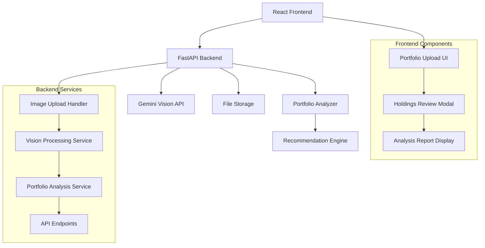

# Smart Portfolio Scan Design Document

## Overview

The Smart Portfolio Scan feature integrates Google Gemini Pro Vision AI with the existing MarketMind platform to provide automated portfolio analysis from brokerage app screenshots. Users upload portfolio images, the system extracts holdings using AI vision, and provides comprehensive analysis with investment recommendations.

The feature consists of three main components: a FastAPI backend service for image processing and AI integration, a React frontend for user interaction and results display, and a portfolio analysis engine that evaluates diversification and generates recommendations.

## Architecture

The system follows a client-server architecture with clear separation between the presentation layer (React), API layer (FastAPI), and AI processing layer (Google Gemini Vision).



## Components and Interfaces

### Backend Components

#### 1. Vision Engine Service (`backend/vision_engine.py`)
- **Purpose**: Handles Google Gemini Vision API integration for portfolio image analysis
- **Key Methods**:
  - `analyze_portfolio_image(image_bytes: bytes) -> PortfolioAnalysisResult`
  - `configure_gemini_client() -> GenerativeModel`
- **Dependencies**: `google-generativeai`, environment variable `GOOGLE_API_KEY`

#### 2. Portfolio Analysis API (`backend/main.py`)
- **Purpose**: FastAPI endpoints for portfolio scanning workflow
- **Key Endpoints**:
  - `POST /api/portfolio/analyze-image`: Upload and analyze portfolio screenshot
  - `GET /api/portfolio/analysis/{analysis_id}`: Retrieve analysis results
- **Dependencies**: `fastapi`, `python-multipart`, `vision_engine`

#### 3. File Upload Handler
- **Purpose**: Manages image file validation and processing
- **Validation Rules**:
  - Supported formats: PNG, JPG, JPEG
  - Maximum file size: 10MB
  - Image dimension validation

### Frontend Components

#### 1. Portfolio Upload Component
- **Purpose**: Handles file selection and upload UI
- **Features**:
  - Drag-and-drop file upload
  - File format and size validation
  - Upload progress indication
  - Loading state during AI processing

#### 2. Holdings Review Modal
- **Purpose**: Displays extracted holdings for user confirmation
- **Features**:
  - Editable ticker symbols and quantities
  - Ticker symbol validation
  - Confirmation and correction workflow

#### 3. Analysis Report Display
- **Purpose**: Shows comprehensive portfolio analysis results
- **Features**:
  - Health score visualization (1-10 scale with progress bar)
  - Risk profile display with visual indicators
  - Investment recommendations with reasoning
  - Professional styling consistent with MarketMind design

## Data Models

### PortfolioHolding
```python
class PortfolioHolding(BaseModel):
    ticker: str
    quantity: float
    confidence: float  # AI extraction confidence (0-1)
```

### PortfolioAnalysis
```python
class PortfolioAnalysis(BaseModel):
    health_score: int  # 1-10 diversification score
    risk_profile: str  # "Conservative", "Moderate", "Aggressive"
    strengths: List[str]
    weaknesses: List[str]
    total_value: Optional[float]
```

### InvestmentRecommendation
```python
class InvestmentRecommendation(BaseModel):
    ticker: str
    reason: str
    improvement_type: str  # "diversification", "risk_reduction", "sector_balance"
    priority: int  # 1-3 ranking
```

### PortfolioAnalysisResult
```python
class PortfolioAnalysisResult(BaseModel):
    extracted_holdings: List[PortfolioHolding]
    analysis: PortfolioAnalysis
    recommendations: List[InvestmentRecommendation]
    processing_time: float
    timestamp: datetime
```

## Correctness Properties

*A property is a characteristic or behavior that should hold true across all valid executions of a system—essentially, a formal statement about what the system should do. Properties serve as the bridge between human-readable specifications and machine-verifiable correctness guarantees.*

### Property 1: File Format Validation
*For any* uploaded file, the system should accept files with PNG, JPG, or JPEG extensions and reject all other formats with appropriate error messages
**Validates: Requirements 1.1**

### Property 2: File Size Validation  
*For any* uploaded file, the system should accept files under 10MB and reject files over 10MB with descriptive error messages
**Validates: Requirements 1.2**

### Property 3: Error Message Clarity
*For any* invalid file upload (wrong format, too large, corrupted), the system should return a specific, actionable error message that guides user resolution
**Validates: Requirements 1.3, 7.4**

### Property 4: Loading State Display
*For any* image processing request, the system should display loading indicators from upload start until results are displayed
**Validates: Requirements 1.4, 7.2**

### Property 5: Extraction Data Structure
*For any* successful portfolio image analysis, the returned data should contain a list of holdings with ticker and quantity fields matching the expected schema
**Validates: Requirements 2.2**

### Property 6: Holdings Confirmation Workflow
*For any* extracted holdings, the system should display a confirmation modal allowing editing before proceeding to analysis
**Validates: Requirements 3.1, 3.2**

### Property 7: Ticker Symbol Validation
*For any* ticker symbol entered during holdings review, the system should validate against known market symbols and flag invalid entries
**Validates: Requirements 3.3**

### Property 8: Health Score Range
*For any* portfolio analysis, the calculated health score should be an integer between 1 and 10 inclusive
**Validates: Requirements 4.1**

### Property 9: Risk Profile Classification
*For any* portfolio analysis, the risk profile should be classified as exactly one of "Conservative", "Moderate", or "Aggressive"
**Validates: Requirements 4.2**

### Property 10: Recommendation Count
*For any* completed portfolio analysis, the system should generate exactly 3 investment recommendations
**Validates: Requirements 5.1**

### Property 11: Recommendation Reasoning
*For any* investment recommendation, there should be a clear reason explaining why the stock improves the portfolio
**Validates: Requirements 5.2, 5.3**

### Property 12: Environment Variable Configuration
*For any* system startup, the Google API key should be retrieved from the GOOGLE_API_KEY environment variable and never from hardcoded values
**Validates: Requirements 6.1, 6.2**

### Property 13: Configuration Error Handling
*For any* missing or invalid API configuration, the system should return a clear configuration error before attempting API calls
**Validates: Requirements 6.3**

### Property 14: API Error Handling
*For any* failed Google Gemini API call, the system should provide appropriate error handling and user-friendly error messages
**Validates: Requirements 6.4**

## Error Handling

### Image Processing Errors
- **Invalid file format**: Return HTTP 400 with format requirements
- **File too large**: Return HTTP 413 with size limit information  
- **Corrupted image**: Return HTTP 422 with re-upload suggestion
- **AI extraction failure**: Return HTTP 500 with retry option

### API Integration Errors
- **Missing API key**: Return HTTP 500 with configuration instructions
- **API rate limiting**: Return HTTP 429 with retry-after header
- **API service unavailable**: Return HTTP 503 with fallback options
- **Invalid API response**: Return HTTP 502 with error details

### Portfolio Analysis Errors
- **No holdings detected**: Return HTTP 422 with manual entry option
- **Invalid ticker symbols**: Return HTTP 400 with correction suggestions
- **Analysis timeout**: Return HTTP 408 with partial results if available

## Testing Strategy

### Dual Testing Approach
The system requires both unit tests and property-based tests for comprehensive coverage:

**Unit Tests** focus on:
- Specific file format validation examples
- Known portfolio analysis scenarios  
- API integration error conditions
- UI component behavior with mock data

**Property-Based Tests** focus on:
- Universal file validation rules across all input types
- Portfolio analysis correctness across diverse holdings combinations
- API error handling across various failure scenarios
- UI state management across different user interaction patterns

### Property-Based Testing Configuration
- **Framework**: Use `hypothesis` for Python backend tests and `fast-check` for JavaScript frontend tests
- **Test Iterations**: Minimum 100 iterations per property test
- **Test Tagging**: Each property test must reference its design document property
- **Tag Format**: **Feature: smart-portfolio-scan, Property {number}: {property_text}**

### Testing Implementation Requirements
- Each correctness property must be implemented as a single property-based test
- Property tests should generate diverse, realistic test data (various file types, portfolio compositions, API responses)
- Unit tests should complement property tests by testing specific edge cases and integration points
- All tests must pass before feature completion